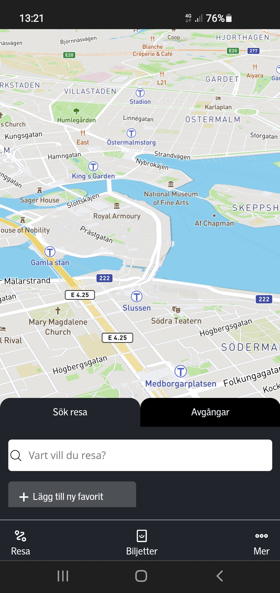
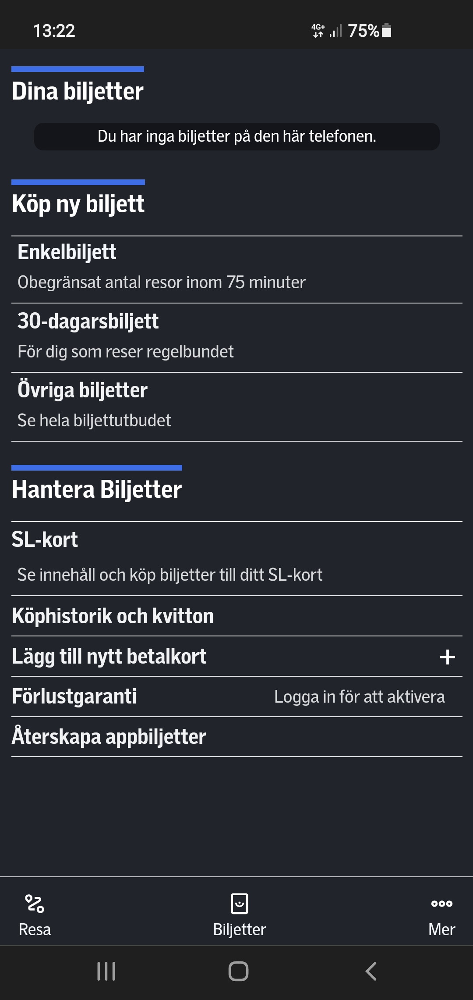
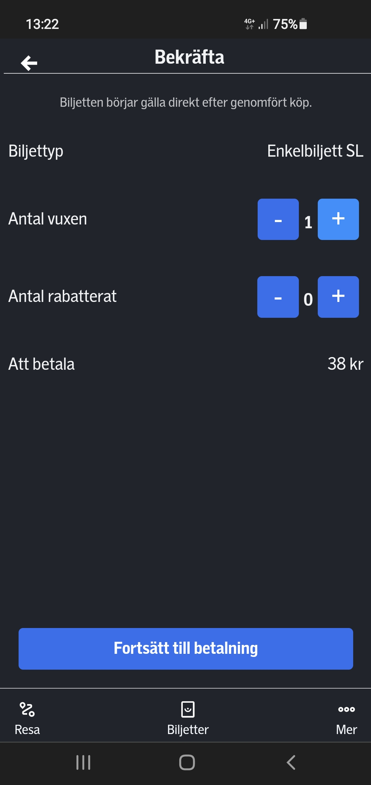
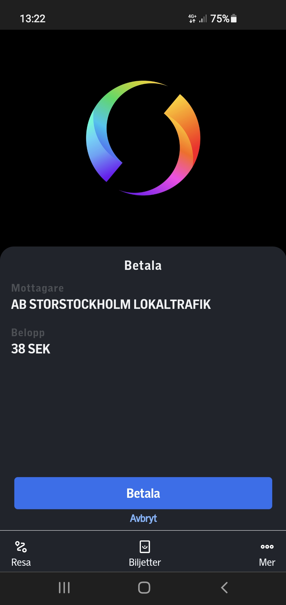
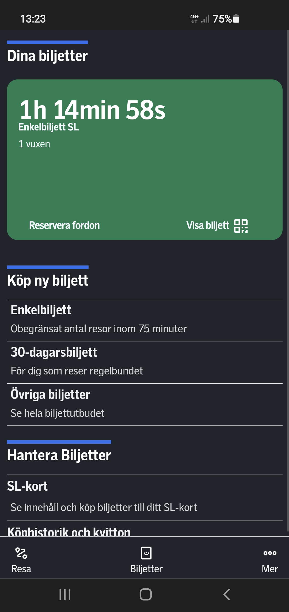
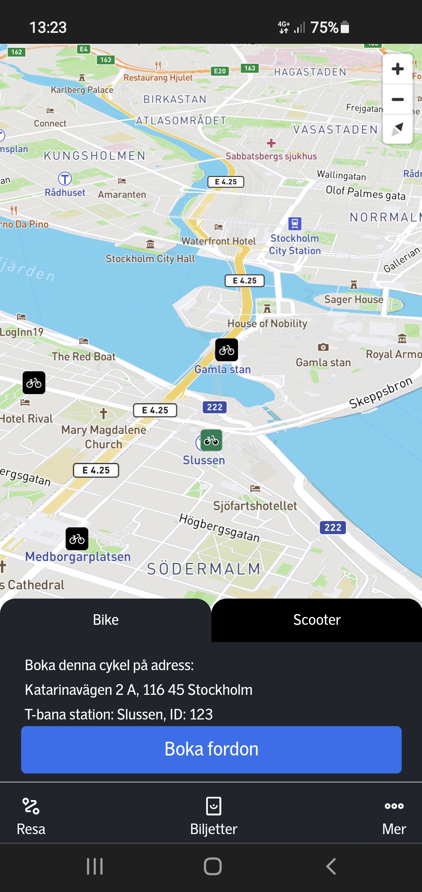
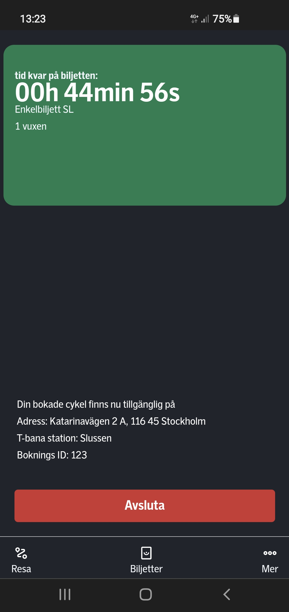

# __SL APP / BIKES__  _(& SCOOTERS )_

----
 

#  __Description:__

This project is an school assignment at KYH Stockholm frontend education. 
The goal was to create a prototype (mvp) in groups and then implement the UX design as a solo project.
You could choose which ever way you wanted to implement the design, with or without a frameworks.

 

---
 

# __Languages and Tools:__
[][vscode]
[][react-js]
[][html]
[][css]
[][javascript]
 

- [react-router-dom]
- [mapbox]  
- [framer-motion]
- [styled-components]
- [json-server]
- ☕

 

---
 

##  __Preview__

 &nbsp; &nbsp;
 &nbsp; &nbsp;
 &nbsp; &nbsp;
 &nbsp; &nbsp;
 &nbsp; &nbsp;
 &nbsp; &nbsp;
 &nbsp; &nbsp;

 

---
 

# The idea 

So our idea was a extension to Greater Stockholm local traffic, adding bikes and scooters to compete with other companies who deliver the same.
Also the subject was sustainable travel, so either do a new idea to an app or work on an existing one.
Here you can see the prototype the group did in figma...
https://www.figma.com/proto/rPnOvgfPEs23B0CQ9S0yLM/Prototype-Main-Group-2-H%C3%A5llbart-Resande?node-id=77%3A53&starting-point-node-id=77%3A53

# The work

My own work I started with the feedback, change all the info we gathered as group but also the feedback I gathered when diong my own testing, some people tried out my work in progress, after that I started to work on making it look more like tha actuall app. 
Then I got some feedback on the buttons and icons so I tried to change them a bit.
The icons we found on SL´s figma page, also the sizes to styling and fonts

# __To try this out__

You can download or clone the code and install the node packages
Get your own API key from mapbox
Clear your localstorage to see all the information (some will dissapear after first time usage)

Also if you want to check Receipts "köphistorik och kvitton" link/page 
- Start a json-server
json-server --watch ./data/db.json --port 8000
On vs code
 json-server --watch ./data/db.json starting on port 3000
 then open up a  new terminal and npm start the project on 3001

# Working and Clickable in the app (guide)

- Firstpage - read and click away modal or
in the navigator click tickets "biljetter"

- on the tickets page you can click "Enkelbiljett"

- On the confirm you ticketspage you can click on the adult "vuxen" counter and it will work (only choose on ticket thou)
Then click pay

- After You will be redirected and get a active ticket on the screen here you can
check ticket or
- Book a bike on the ticket

- On the book bike / scooters ( scooters not working) 
you can choose a bike, red means not available, green is available. choose the bike adress click book vehicle

- Then its just a counter and an option to finnish

Other clickable stuff with json server the receipt page
Also a card on the sl ticket page

## Well thats about it...
 
---
 

# __THE END!__

## __My Socials__

- Github - [robonexx](https://github.com/robonexx)
- Instagram - [r.o.b_o.n.e](https://www.instagram.com/r.o.b_o.n.e/)
- Linkedin - [Robert Wägar](https://www.linkedin.com/in/robert-w%C3%A4gar-1b4661139/)
- Portfolio - "In the works"

 

--- 
 

## __Email__
- robertwagar@gmail.com

 
---
 

[vscode]: https://code.visualstudio.com/
[react-js]: https://reactjs.org/ 
[javascript]: https://developer.mozilla.org/en-US/docs/Web/JavaScript
[react-router-dom]: https://reactrouter.com/web/guides/quick-start
[framer-motion]: https://www.framer.com/motion/
[mapbox]: https://www.mapbox.com/
[html]: https://www.w3schools.com/html/
[css]: https://www.w3.org/Style/CSS/Overview.en.html
[styled-components]: https://styled-components.com/
[localstorage]: https://developer.mozilla.org/en-US/docs/Web/API/Window/localStorage
[json-server]: https://newbedev.com/javascript-how-to-install-json-server-in-vscode-code-example

